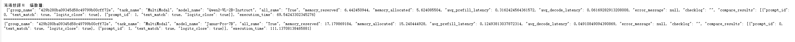
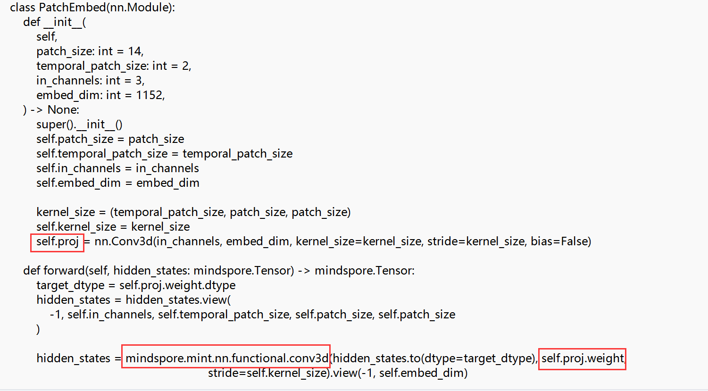
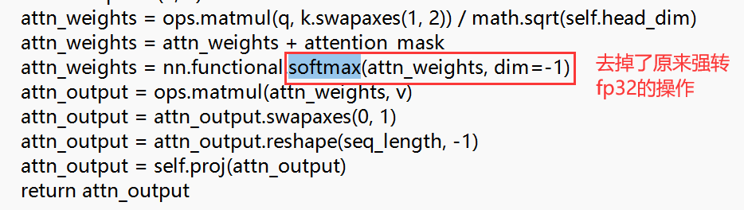
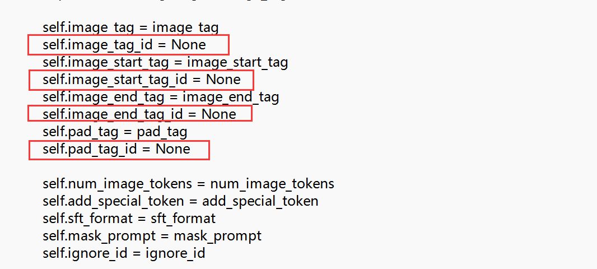
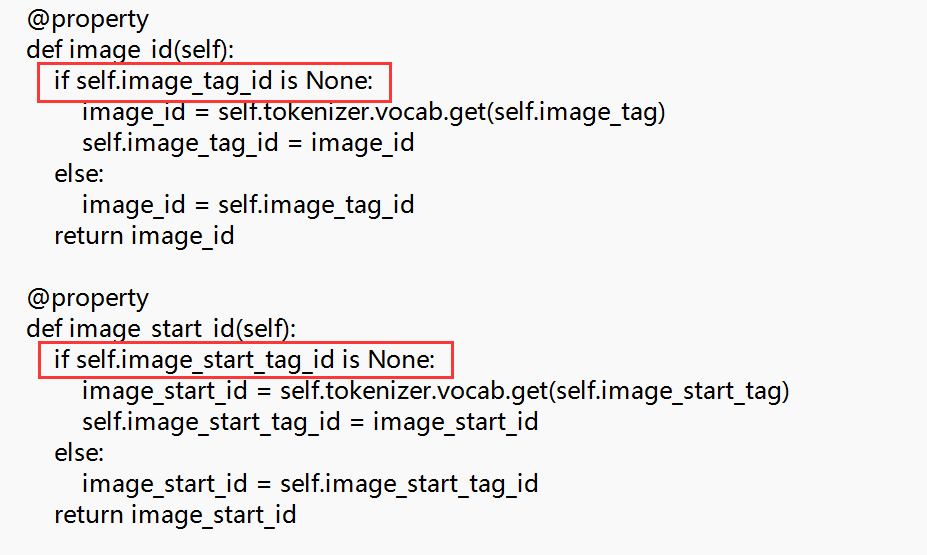
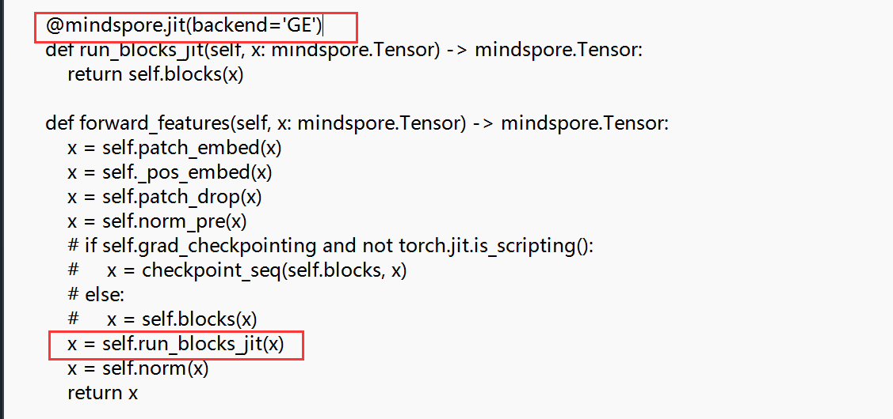
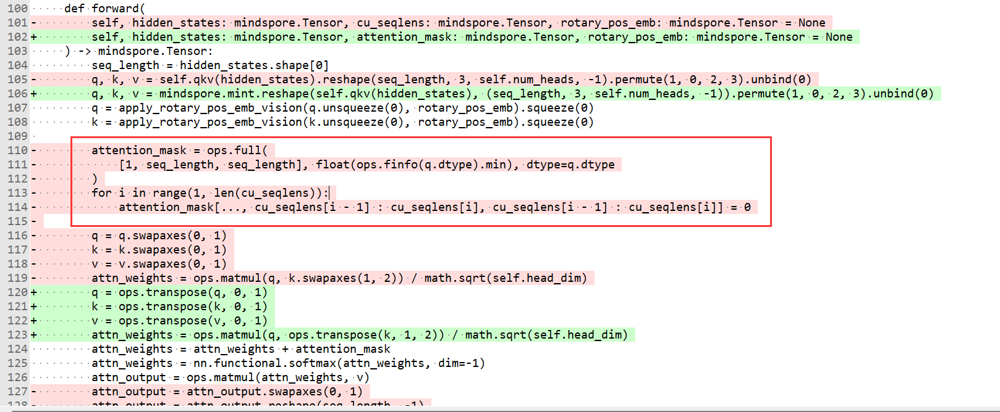
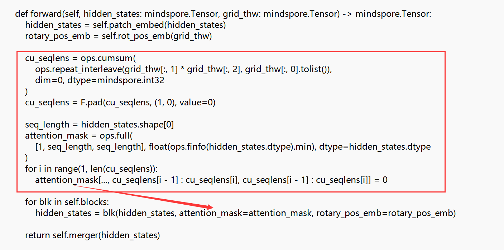

# 2025年昇腾AI创新大赛-昇思模型开发挑战赛（S1赛季)--MultiModal赛题--好树花生队提交说明

## 运行时长如下：

</img>

## 优化点分为以下方面：

1.qwenvl模型中有大量api替换，分别有mindspore.ops.rms_norm替换原来的实现，然后大量直接从tensor调用的方法，比如tensor.broadcast替换成mint中的方法，还有transpose、unsqueeze等方法

2.qwenvl模型中的conv3d操作，原本调用的方法速度慢，改成mindspore.mint.nn.functional.conv3d后能够明显提升

</img>

3.两个模型中softmax的操作，默认使用了fp32数据类型，改成默认的bf16，能够有轻微提升

</img>

4.qwenvl模型的预处理阶段，在processing_vlm.py文件中，其使用tokenizer获得tag的4个方法操作很耗时，每次都重复执行，且每次操作都是一样的，所以改成在类初始化时就获取，后面直接使用现成的值，这样能够大大降低预处理的时间

</img>
</img>

5.janus模型中的modeling_vlm.py文件里有大量打印，发现删除那些print后，速度偶尔有轻微提升

6.janus的siglip_vit.py文件中，对forward_features方法中的blocks运算加jit，速度能明显提升，forward_head方法也加了jit，但速度提升不明显，有时感觉有轻微提升，有时却一点都没有提升

</img>

7.qwenvl模型中vision模块的attention_mask重复计算了，将其提取到layer的for循环之外，保证就执行一次

</img>
</img>

以上就是主要的几个修改点

# 最终优化结果：
| 评测指标 | 平均得分 |
|---------|---------|
| 峰值显存得分 | 116.6667 |
| Prefill时延得分 | 382.3937    |
| Decode时延得分 | 154.2476     |
| **总分** | **217.7693** |